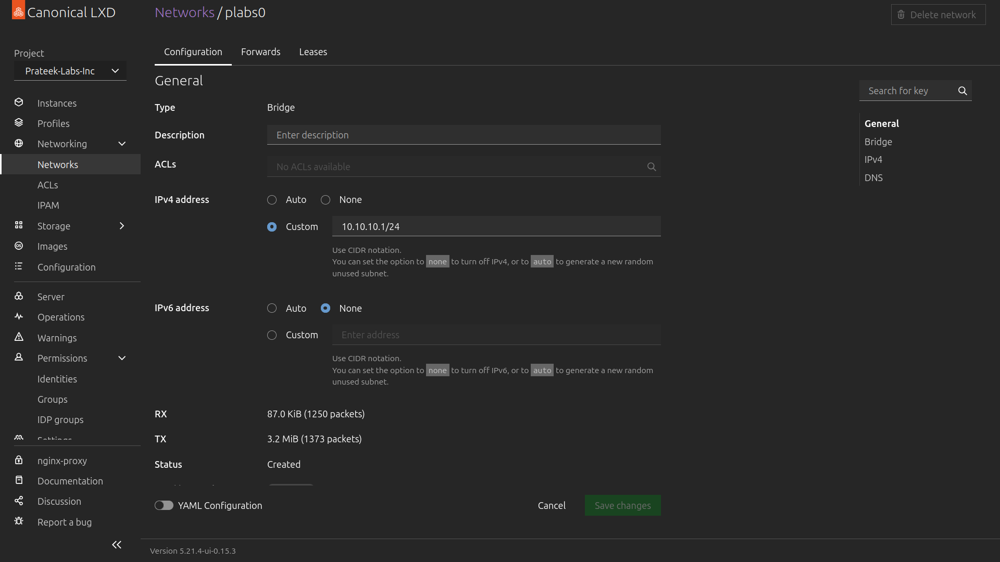
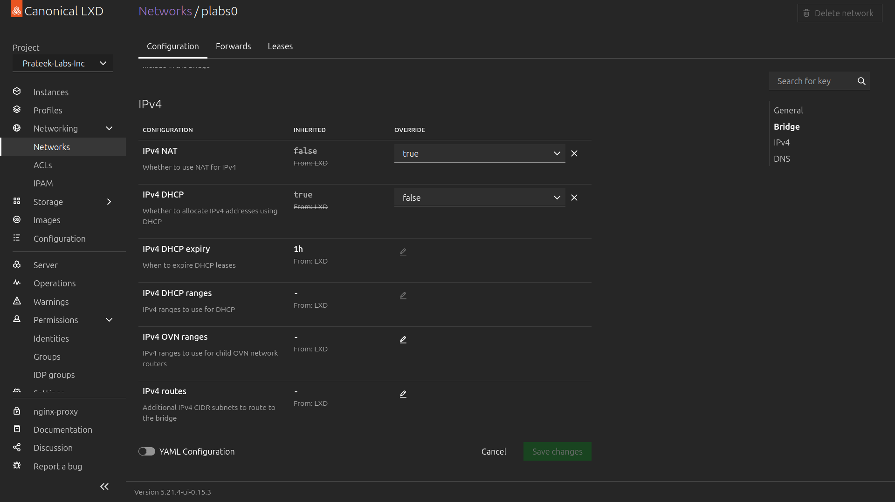
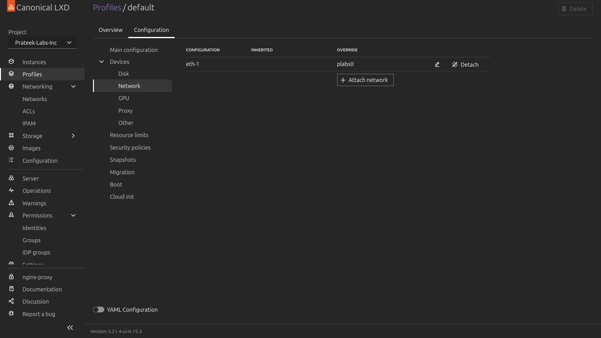
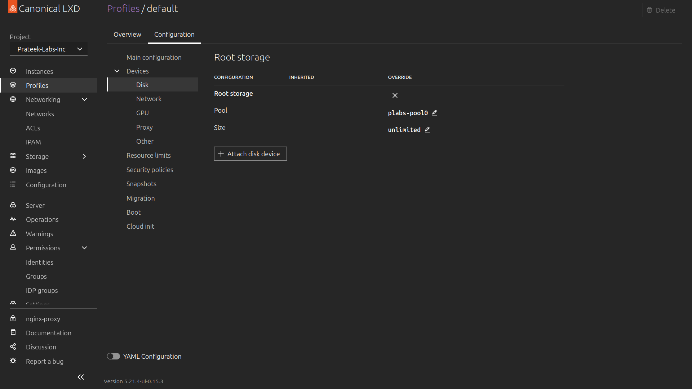

# LXD Setup

For installation of LXD please refer to [Canonical's Official LXD installation guide](https://canonical.com/lxd/install). Set up LXD as it is said in the guide.

Now that, Installation of LXD is done, let's continue.

## Configuring LXD

After installation open expose LXD Web UI to port `8443` to do this enter the following command :-

```bash
lxc config set core.https_address :8443
```

Now, LXD Web UI will be exposed to `https://localhost:8443`. After opening a link on the web browser LXD will ask you to create a new cert.

To Access the LXD Web UI you need to create a cert file and import it to your browser I recommend to once again refer to [LXD's Official docs](https://documentation.ubuntu.com/lxd/latest/howto/access_ui). Now, you should have access to the LXD Web UI.

Once you are inside the LXD Web UI you need to do the following things.

- Create new LXD Project
- Configure networking
- Configure storage (dir storage)

### Creating new Project

You can create a new project from UI or from the command below :-

```bash
lxc project create [project_name] --config features.images=false --config features.profiles=false
```

For the sake of simplicity I would recommend setting project_name to `Prateek-Labs-Inc`. But, you can name your project whatever you want.

### Configuring Networking

For generating static IP's we need to create a new network interface and remove DHCP. Below is the following command :-

```bash
lxc network create [network_name]
```

Now that new network is created, to configure it we will use LXD Web UI.

Navigate to :- Networking > Networks > Your Network name, On `General` section set `IPv4 address` to custom `10.10.10.1/24` and disable `IPv6 address`



Now, head down towards the `IPv4` section and set `IPv4 NAT` to `true`. This is very important as it will help you to connect to the internet from VM. Set `IPv4 DHCP` to `false`, this will disable DHCP.



Once this is done, select your project and navigate to Profiles > default > configuration tab > Devices > Network and here remove any default network interface connected and attach network interface which you just configured.



### Configuring Storage

LXD supports many different types of storage options. To make setup easy I will be using Dir Storage Pool, You can use whatever you want to configure storage please refer to [LXD's Official docs](https://documentation.ubuntu.com/lxd/latest/howto/storage_pools).

After configuring storage select your project and navigate to Profile > configuration tab > Devices > Disk and remove existing pool and add your pool which you just created.



Now, LXD is ready to use.

> [!NOTE]
> If internet is not working VM enter the following command in your terminal.

```bash
lxc network set [interface_name] ipv4.firewall false
lxc network set [interface_name] ipv6.firewall false
```